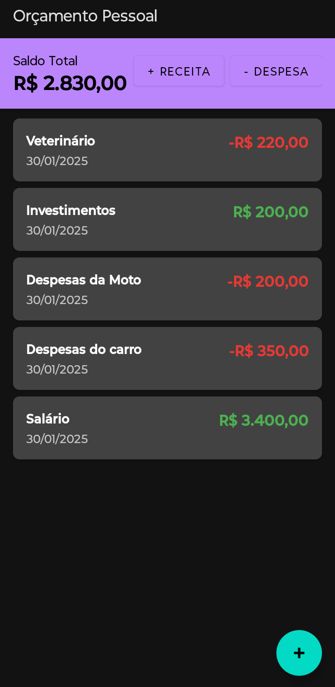
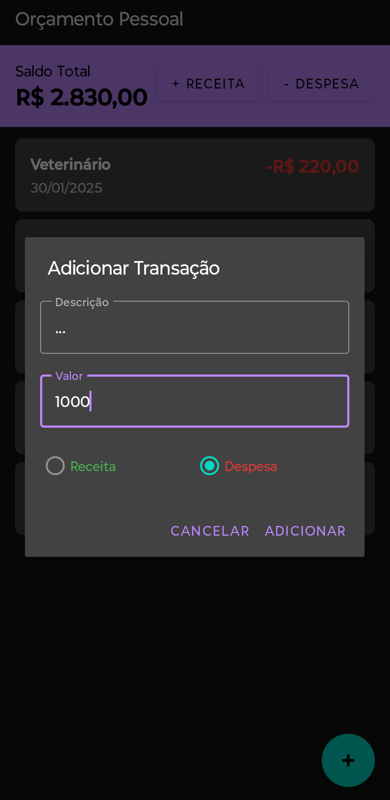
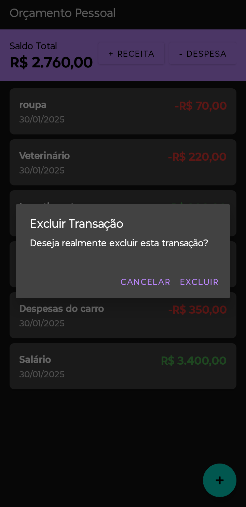

# Orçamento Pessoal

## Descrição do Projeto  
O **"Orçamento Pessoal"** é um aplicativo Android que permite aos usuários gerenciar suas finanças pessoais de forma eficiente. O app oferece funcionalidades para:  
- Registrar receitas e despesas  
- Visualizar o saldo total  
- Categorizar transações  

Com isso, o usuário obtém uma visão clara de suas finanças.  

## Imagens

*Acima está uma captura de tela inicial da aplicação já com valores.*

*Acima está uma captura de tela inicial da aplicação sem os valores.*

*Acima está uma captura de tela com inserção de valores.*

*Acima está uma captura de tela com exclusão de valores.*

*Acima está uma captura de tela com o Icone da aplicação.*

## Tecnologias Utilizadas  

### Frontend  
- **Kotlin**: Linguagem principal do desenvolvimento Android. Sintaxe moderna e segura, integrada ao Android SDK.  
- **XML**: Utilizado para a definição da interface do usuário (UI), permitindo uma separação clara entre lógica e apresentação.  

### Backend  
- **Room**: Biblioteca de persistência que abstrai o SQLite, tornando o armazenamento e a recuperação de dados mais eficientes.  
- **Coroutines**: Para operações assíncronas, garantindo uma interface responsiva mesmo durante processos demorados.  

## Funcionalidades Implementadas  

- **Registro de Transações**  
  - Adição de receitas e despesas com descrição, valor e categoria.  

- **Visualização de Saldo**  
  - Cálculo e exibição do saldo total com base nas transações registradas.  

- **Listagem de Transações**  
  - Exibição de todas as transações, com opções para visualizar detalhes e excluir itens.  

- **Modo Escuro**  
  - Interface adaptável para ambientes com pouca luz.  

- **Ícone Personalizado**  
  - Ícone adaptável que se ajusta aos padrões do Android.  

## Justificativa da Utilidade  
O **"Orçamento Pessoal"** é uma ferramenta essencial para quem deseja controlar suas finanças de forma eficiente. Ele auxilia na criação de hábitos financeiros saudáveis, permitindo:  
- Registro e categorização de gastos  
- Visualização clara do saldo total  
- Melhor planejamento financeiro  

Com isso, os usuários podem economizar e se preparar para o futuro de maneira mais organizada.  

## Contribuições

Contribuições são bem-vindas! Se você quiser sugerir melhorias ou adicionar novas funcionalidades, fique à vontade para abrir uma issue ou fazer um pull request.  

## Créditos

Desenvolvido por Mateus S.  
GitHub: [Matz-Turing](https://github.com/Matz-Turing)

